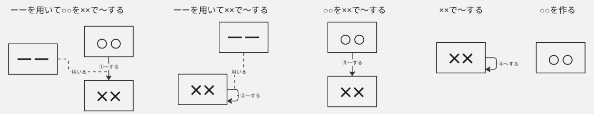
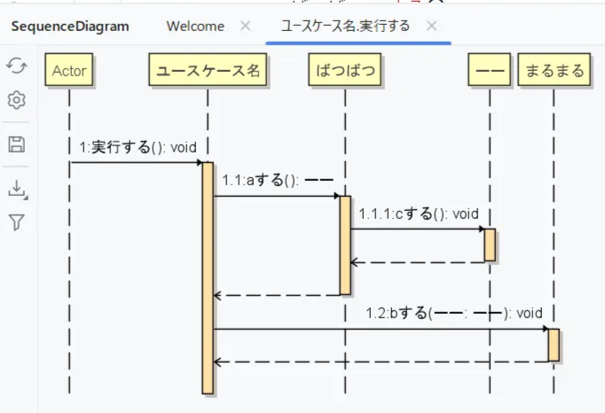

# ガイドライン

## ①ユースケース記述を書く

ユースケース記述を書くことで、顧客の実現したいことを詳細なフローで示しましょう。その際に、顧客の用いる言葉や顧客の考える処理の手順をそのまま表現することでメンタルモデルを反映しましょう。ソースコードを書いて実装することも踏まえ、「プレゼンテーション層」「ドメイン層・ビジネスロジック層」「データアクセス層」に分けて考えましょう。

1. ユースケース図を作成する
2. 一つずつのユースケースに対し、ユースケース記述を作成する
3. ユースケース記述のメインフローを、ユーザの入出力のフロー（プレゼンテーション層）と計算・判断・加工・データベースの入出力のフロー（ドメイン層、ビジネスロジック層、データアクセス層）・データベースの処理に分けて
**・「ーーを用いて○○を××で～する」
・「ーーを用いて××で～する」
・「○○を××で～する」
・「××で～する」
・「○○を作る」**
のいずれかの形で一文ずつ記述する
4. データベースの入出力の文は斜体の太字にする
5. 記述した文にそれぞれの層ごとで通し番号を振る

補足

- ユーザの入出力のフローから計算・判断・加工のフローへ処理が続くときは「○○を用いて[ユースケース名]で実行する」のように記述する
- 一文に「計算」「判断」「加工」「入力」「出力」が一つのみ含まれるようにする（一文がなるべく短くなることを意識すると良い）
- **正解は一通りではないです！**

## ②モデリングをする

ユースケースごとに「どのクラスがどんなメソッドを持ち、それがどこのクラスで呼び出されるのか。その際に必要な引数はなにか」を図示して整理するためにモデリングしましょう。

このガイドラインは「ドメイン層・ビジネスロジック層」に注目したものなので、②以降の手順は「ドメイン層・ビジネスロジック層」にのみ行います。

1. ドメイン層のフロー内の○○と××を一つ一つ四角に書き出す
2. ユースケース名が記入された四角を作り、プレゼンテーション層とドメイン層の間に配置する
3. ○○と××の間に○○→××のように矢印を繋ぐ
○○がないときは××自身に矢印を繋ぐ
4. 矢印に「～する」を書く
5. ユースケース記述に「ーーを用いて」がある場合は、ーーを四角にして「～する」の矢印に点線を繋ぎ点線上に「用いる」と書く



## ③コードを書く

②で整理したモデルをソースコードに反映させましょう。

1. モデリングの計算・判断・加工・データベースの入出力のフロー内の四角で囲った○○や××、ーーをクラスとしてdomainパッケージに作成する。データベースの入出力に関わる部分はdomainパッケージにインターフェースとして実装する
2. ユースケース名のクラスをusecaseパッケージに作成する
3. 矢印に記述した「～する」をメソッドとして矢印の先のクラス（××）に実装する。
4. 矢印に「用いる」の線が繋がっている場合は「～する」メソッドの引数にする。
5. ユースケース名のクラスに「実行する」メソッドを作成し、計算・判断・加工のフローの順番通りになるようにメソッドを呼び出す。実行するメソッドの引数にはユーザの入出力のフローから持ってくる値を入れる

補足

- 修飾されてる名詞は修飾語を含めたクラスとして実装するのか、被修飾語のクラスを実装して修飾語は変数として定義するときにつけるのか、どちらが分かりやすいか考えてみましょう
- 実行するメソッドの引数にしたい値が多い場合は、入力を「○○データレコード」でまとめて、getterのメソッドを作ることで取得できるようにする方法もあるので、分かりやすい方で実装してみましょう

1と2の手順のイメージ


3以降の手順のイメージ


```java
public class ユースケース名 {
    void 実行する() {
        まるまる = ばつばつ.する(ーー);
    }
}

public class ばつばつ {
    public まるまる する(ーー ーー) {
        // ーーを用いた処理
        // newに引数があってもよい
        return new まるまる();
    }
}
```


```java
public class ユースケース名 {
    void 実行する() {
        ばつばつ.する(ーー);
    }
}

public class ばつばつ {
    public void する(ーー ーー) {
        // ーーを用いた処理
    }
}
```


```java
public class ユースケース名 {
    void 実行する() {
        まるまる = ばつばつ.する();
    }
}

public class ばつばつ {
    public まるまる する() {
        // 処理
        // newに引数があってもよい
        return new まるまる();
    }
}
```


```java
public class ユースケース名 {
    void 実行する() {
        ばつばつ.する();
    }
}

public class ばつばつ {
    public void する() {
        // 処理
    }
}
```


```java
public class ユースケース名 {
    void 実行する() {
        new まるまる();
    }
}

public class ばつばつ {
    public まるまる する(ーー ーー) {
        // ーーを用いた処理
        // newに引数があってもよい
        return new まるまる();
    }
}
```

## ④確認用文章を作成する

①～③を経て、ソースコードの内部構造がどのようになったのか、確認するための文章を作りましょう。

1. ユースケースクラスの「実行する」メソッドのシーケンス図を出力する
2. シーケンス図のクラスとライフライン、その引数のクラス名を以下のテンプレートのようにつなぎ一文にする

```java
テンプレート
クラス（○○、××）・ライフライン（～）・引数のクラス名（ーー）

「ーーを用いて××で～する　
	○○を作る」
「ーーを用いて××で～する」
「××で～する　
	○○を作る」
「××で～する」
「○○を作る」
※createは「作る」に置き換える
```

1. シーケンス図の番号ごとに並べる。階層ごとに字下げする。

作成イメージ



**→**

```java
1 ユースケース名で実行する
	1.1 ばつばつでaする
		1.1.1 ーーでcする
		1.1.2 ーーを作る
	1.2 ーーを用いてまるまるでbする
```

## ⑤リファクタリングをする

最初に作成した要件を示す文章とソースコードから作成した確認用文章を見比べて、要件をそのままソースコードに反映させることができているのか確認しましょう。増減がある、表現が変わっているなど、反映できていない場合はどの手順から増減や表現の変化が起こったのかを確かめ、「要件を示す文章」「モデリング」「ソースコード」のどれかを書き直し、最初に作成した要件を示す文章とソースコードから作成した確認用文章が対応するようにしましょう。

1. ユースケース記述と確認用文章を見比べる
2. ユースケース記述と確認用文章に相違がないよう、①～③のどの部分を改良するか考える
3. 2で考えたことをもとに改良してみる
4. 再度④を行う
5. 1~4を繰り返す